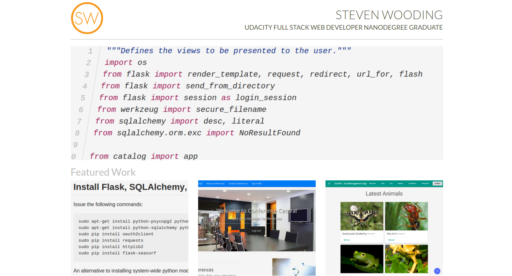

# My Portfolio Web Page

This is a one page responsive website, using the Bootstrap framework, that
showcases various Udacity and personal projects I’ve completed.

The visual design of the website was provided by Udacity (see file
[mock3-portfolio-1.pdf](mock3-portfolio-1.pdf)) as an exercise in taking a
design mock up and coding it up.

This website is live at [portfolio.stevenwooding.com](http://portfolio.stevenwooding.com).
Clicking on each project image to display more information.